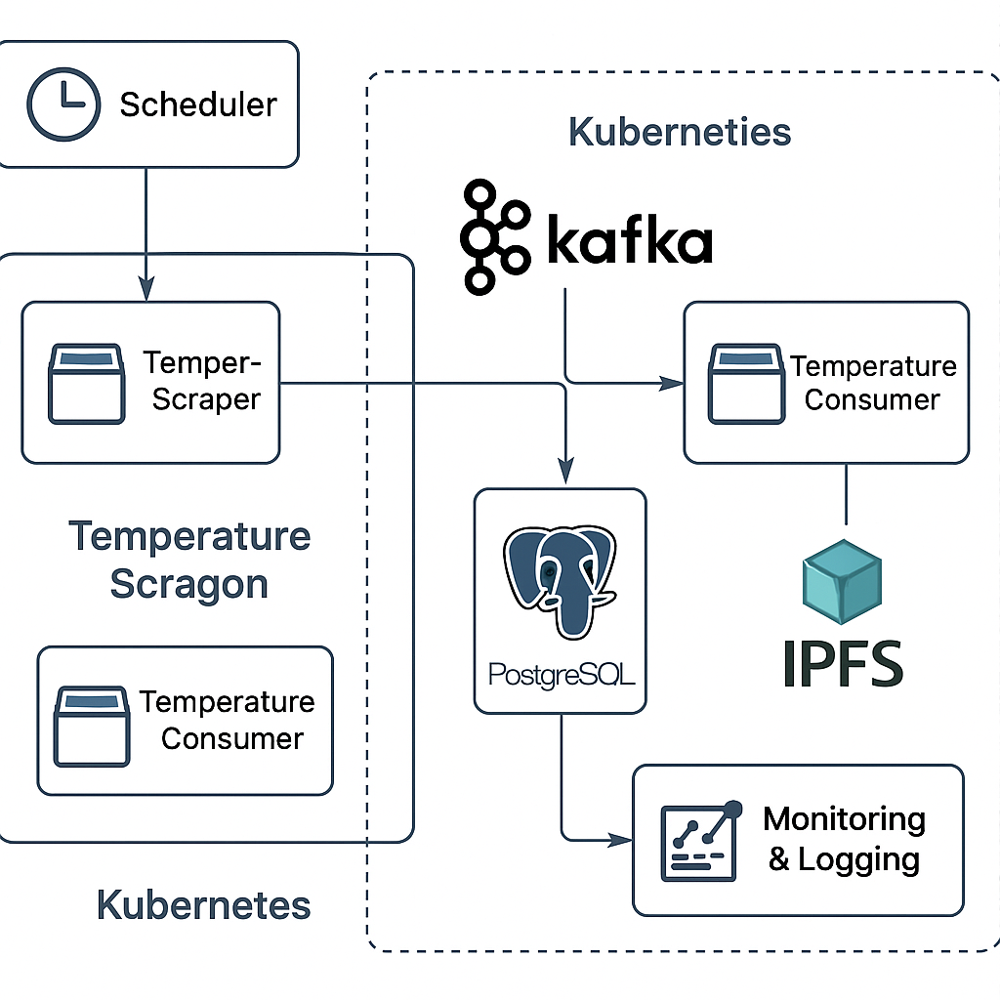
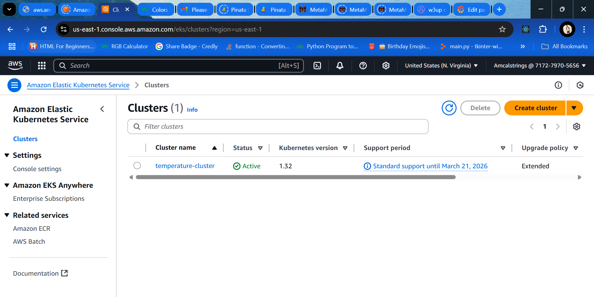
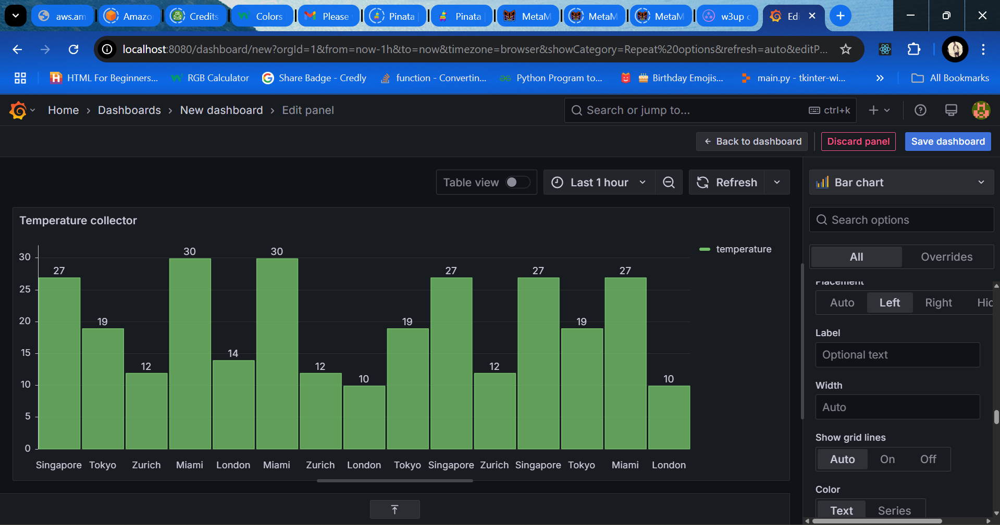
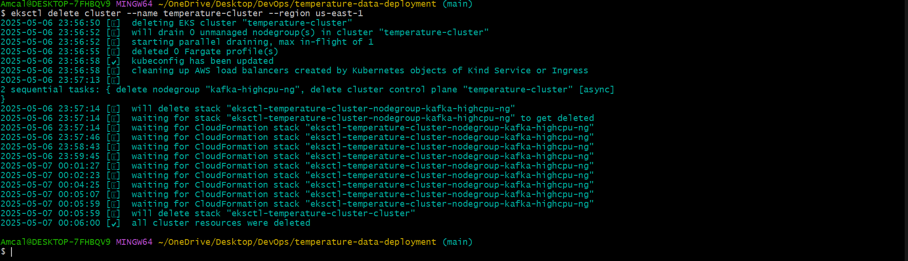

# Temperature Data Collection Project

This project builds a scalable, containerized system for collecting, processing, storing, and visualizing temperature data for multiple cities using cloud-native tools.

## Table of Contents

* [Architecture Overview](#architecture-overview)
* [Components](#components)
* [Setup Instructions](#setup-instructions)
* [IPFS Storage](#ipfs-storage)
* [Monitoring](#monitoring)
* [Deployment Process](#deployment-process)
* [Rollback](#rollback)
* [Cleanup](#cleanup)

---

## Architecture Overview



* **Temperature Scraper (CronJob)**: Scrapes temperatures from `wttr.in` every hour.
* **Kafka Broker**: For asynchronous communication between scraper and consumer.
* **Temperature Consumer**: Reads from Kafka and stores into PostgreSQL.
* **PostgreSQL**: Relational DB to store the scraped temperature records.
* **IPFS**: Manual archival of data for public access.
* **Prometheus + Grafana**: Monitoring and alerting.

---

## Components

### 1. Temperature Scraper

* Scheduled every hour via a Kubernetes CronJob.
* Sends temperature data (JSON) to a Kafka topic `temperature`.

### 2. Kafka Consumer

* Listens on Kafka topic `temperature`.
* Inserts parsed data into PostgreSQL `temperatures` table.

### 3. PostgreSQL Schema

File: `database/schema.sql`

```sql
CREATE TABLE IF NOT EXISTS temperatures (
    id SERIAL PRIMARY KEY,
    city VARCHAR(50),
    temperature DECIMAL,
    timestamp TIMESTAMPTZ DEFAULT CURRENT_TIMESTAMP
);
```

> After PostgreSQL is deployed, apply the schema manually:

```sh
kubectl cp database/schema.sql <postgres-pod>:/schema.sql
kubectl exec -it <postgres-pod> -- psql -U postgres -d temperatures -f /schema.sql
```

### 4. IPFS Storage

Script: `ipfs_store.py`

* Run manually to store selected data to IPFS.
* Returns a public IPFS hash URL.

### 5. Monitoring Stack

* Installed via Helm using `monitoring-values.yaml`
* Includes Prometheus, Grafana, node-exporter

---

## Setup Instructions

### Prerequisites

* EKS Cluster (via `eksctl`)

* Helm installed
* kubectl configured for EKS
* Docker installed

### Steps

1. Build and push your images to ECR:

   ```sh
   docker build -t <your-consumer-image> ./consumer
   docker push <your-ecr-url>/<your-consumer-image>

   docker build -t <your-scraper-image> ./temp_scraper
   docker push <your-ecr-url>/<your-scraper-image>
   ```

2. Deploy components:

   ```sh
   kubectl apply -f K8s/postgres_deployment.yaml
   kubectl apply -f K8s/consumer-deployment.yaml
   kubectl apply -f K8s/scraper-cronjob.yaml
   ```

3. Install monitoring:

   ```sh
   helm repo add prometheus-community https://prometheus-community.github.io/helm-charts
   helm install monitoring prometheus-community/kube-prometheus-stack -f monitoring-values.yaml
   ```

4. Manually test data ingestion:

   Copy and run test insert script:

   ```sh
   kubectl cp insert_data.py <consumer-pod>:/app/insert_data.py
   kubectl exec -it <consumer-pod> -- python /app/insert_data.py
   ```

5. Validate PostgreSQL contains test data:

   ```sh
   kubectl exec -it <postgres-pod> -- psql -U postgres -d temperatures -c "SELECT * FROM temperatures;"
   ```

---

## IPFS Storage

To archive data manually to IPFS:

```sh
python3 ipfs_store.py
```

* Make sure you have access to an IPFS gateway like [Infura.io](https://infura.io/)

---

## Deployment Process

A seamless deployment process ensures reliability and easy updates. Here's how to manage deployments for the temperature data system:

### 1. CI/CD (Optional Future Enhancement)

* Integrate GitHub Actions to automatically build and push Docker images to ECR on every commit.
* Use `kubectl` via GitHub Actions to apply new manifests or update images.

### 2. Manual Deployment

#### Update Image

```sh
kubectl set image deployment/temperature-consumer temperature-consumer=<your-new-image>
kubectl set image cronjob/temperature-scraper temperature-scraper=<your-new-image>
```

> Ensure your image is pushed to ECR before applying this.

#### Restart Deployment (to force image pull if using latest tag)

```sh
kubectl rollout restart deployment temperature-consumer
kubectl delete pod <pod-name>  # For CronJobs, wait for next scheduled run
```

#### View Rollout Status

```sh
kubectl rollout status deployment/temperature-consumer
```

---

## Grafana Visualization

Use the following query in Grafana to visualize data:

```sql
SELECT
  timestamp AS "time",
  city,
  temperature
FROM temperatures
WHERE $__timeFilter(timestamp)
```

> Ensure SSL is disabled in the PostgreSQL Grafana data source if not supported. You can confirm PostgreSQL SSL status with:

```sh
kubectl exec -it <postgres-pod> -- psql -U postgres -d temperatures -c "SHOW ssl;"
```


---

## Rollback

If the new image causes issues, quickly revert:

```sh
kubectl rollout undo deployment/temperature-consumer
```

For the CronJob, update the image manually in the YAML and re-apply:

```sh
kubectl apply -f K8s/scraper_cronjob.yaml
```

> Consider versioned tags for Docker images to make rollback easier.

---

## Cleanup

To delete all Kubernetes resources:

```sh
kubectl delete all --all
```

To delete the EKS cluster (if created with `eksctl`):

```sh
eksctl delete cluster --name temperature-cluster
```



---

## Notes

* Logging can be extended using Fluent Bit or Loki.
* For production, secrets should be managed using sealed secrets or AWS Secrets Manager.
* LoadBalancer/Ingress for public access is not needed since all components are internal.
